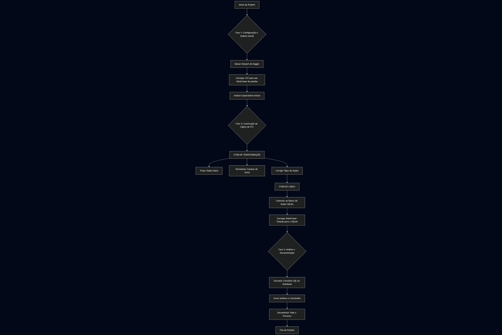

_Caso queira acompanhar meu processo de desenvolvimento, passo a passo, desça para o final do readme e clique na imagem._

# 🚀 Projeto ETL de Análise de Notas Acadêmicas

**Pipeline de Engenharia de Dados com foco em SQL, ETL e Python, utilizando tecnologias gratuitas**

[](LICENSE)
[]()
[]()
[]()

## 📌 Sumário

1.  [Sobre o Projeto](https://www.google.com/search?q=%23-sobre-o-projeto)
2.  [Objetivos](https://www.google.com/search?q=%23-objetivos)
3.  [Tecnologias](https://www.google.com/search?q=%23-tecnologias)
4.  [Estrutura do Projeto](https://www.google.com/search?q=%23-estrutura-do-projeto)
5.  [Pré-requisitos](https://www.google.com/search?q=%23-pr%C3%A9-requisitos)
6.  [Instalação](https://www.google.com/search?q=%23-instala%C3%A7%C3%A3o)
7.  [Como Usar](https://www.google.com/search?q=%23-como-usar)
8.  [Fluxograma do Processo](https://www.google.com/search?q=%23-fluxograma-do-processo)
9.  [Contribuição](https://www.google.com/search?q=%23-contribui%C3%A7%C3%A3o)
10. [Licença](https://www.google.com/search?q=%23-licen%C3%A7a)
11. [Contato](https://www.google.com/search?q=%23-contato)
12. [Recursos Adicionais](https://www.google.com/search?q=%23-recursos-adicionais)

## 💻 Sobre o Projeto

O **Projeto ETL de Análise de Notas Acadêmicas** é uma iniciativa prática para demonstrar e aprimorar habilidades em engenharia de dados. Utilizando um dataset de notas acadêmicas do Kaggle, o objetivo é construir um pipeline completo de **ETL (Extração, Transformação, Carga)**, limpando, organizando e carregando os dados em um banco de dados relacional.

  - **Motivação**: Praticar os conceitos de engenharia de dados, focando em manipulação de dados com Python (`pandas`) e consultas SQL.
  - **Público-alvo**: Estudantes de ciência de dados, engenharia de dados, e profissionais que desejam aprimorar suas habilidades com ferramentas gratuitas.
  - **Problema resolvido**: Dados brutos e desorganizados são inadequados para análise. Este projeto transforma dados de notas acadêmicas em uma base de dados estruturada e pronta para gerar insights.
  - **Diferencial**: Foco na prática com ferramentas gratuitas e um fluxo de trabalho documentado do início ao fim.
  - **Metodologia**: Abordagem "dividir para conquistar", garantindo que cada etapa do pipeline seja implementada e testada de forma robusta.

## 🎯 Objetivos

### 🛠️ Técnico

  - Construir um pipeline de ETL funcional usando Python.
  - Limpar e normalizar dados brutos com a biblioteca `pandas`.
  - Criar e popular um banco de dados relacional com **SQLite**.
  - Escrever consultas SQL para responder a perguntas de negócio sobre os dados.
  - Documentar todo o processo em um Notebook Jupyter.

### 📚 Aprendizagem

  - Entender o ciclo de vida de um projeto de engenharia de dados.
  - Ganhar experiência prática com as etapas de Extração, Transformação e Carga.
  - Aprimorar o conhecimento em SQL para análise de dados.
  - Praticar a criação de código limpo e modular.

## 🚀 Tecnologias

**Linguagem & Bibliotecas**

  - **Python**: Linguagem principal para a lógica de ETL.
  - **Pandas**: Essencial para a manipulação, limpeza e transformação de dados.
  - **SQLite3**: Biblioteca nativa do Python para interagir com o banco de dados SQLite.

**Ferramentas & Ambiente**

  - **Jupyter Notebook**: Ambiente ideal para desenvolver, testar e documentar o fluxo de trabalho.
  - **Visual Studio Code / PyCharm**: IDE de preferência para o desenvolvimento do projeto.
  - **Kaggle**: Fonte do dataset público utilizado.

## 📂 Estrutura do Projeto

```plaintext
docs/                             # Arquivos markdown
readme-imgs/                      # Imagens do readme
projeto_etl_notas/
├── data/
│   └── student_grades.csv        # Arquivo CSV baixado do Kaggle
├── notebooks/
│   └── note1.ipynb               # Notebook Jupyter da fase 1
│   └── note2.ipynb               # Notebook Jupyter das fases 2 e 3
├── db/
│   └── dev.db                    # Banco de dados SQLite gerado
├── README.md                     # Este arquivo
├── LICENSE                       # Licensa do repositório
└── .gitignore                    # Arquivo de ignorados do Git
```

## ⚙️ Pré-requisitos

Para rodar este projeto localmente, você precisará ter:

  - **Python**: Versão 3.6 ou superior
  - **pip**: Gerenciador de pacotes do Python
  - **Jupyter**: Para executar o notebook
  - **Git**: Para clonar o repositório

## 🛠️ Instalação

1.  Clone este repositório:
    ```bash
    git clone https://github.com/lucasgleria/practicing-etl-sql.git
    ```
2.  Navegue até o diretório do projeto:
    ```bash
    cd projeto_etl_notas
    ```
3.  Instale as bibliotecas Python necessárias:
    ```bash
    pip install pandas jupyter
    ```
4.  Baixe o dataset `Student Grades Dataset` do [Kaggle](https://www.kaggle.com/datasets/simranjitkhehra/student-grades-dataset) e salve o arquivo `StudentGrades.csv` dentro da pasta `data/`.

## ❗ Como Usar

1.  Abra o Jupyter Notebook:
    ```bash
    jupyter notebook
    ```
2.  No navegador, navegue até a pasta `notebooks` e abra o arquivo `etl_analise.ipynb`.
3.  Execute as células do notebook em sequência, seguindo as instruções e comentários.
4.  O notebook irá guiar você por cada etapa do processo: carregamento dos dados, limpeza, normalização, criação do banco de dados e execução das consultas SQL.

## 📈 Fluxograma do Processo



## 🤝 Contribuição

Contribuições são bem-vindas! Siga estas etapas:

### **1. Reporte Bugs**
- Abra uma [issue](https://github.com/lucasgleria/practicing-etl-sql/issues) no GitHub
- Descreva o problema detalhadamente
- Inclua logs e screenshots se possível

### **2. Sugira Melhorias**
- Envie ideias através de issues
- Proponha novas funcionalidades
- Discuta melhorias de arquitetura

### **3. Desenvolva**
- Faça um fork do projeto
- Crie uma branch (`git checkout -b feature/nova-funcionalidade`)
- Faça suas alterações seguindo os padrões do projeto
- Adicione testes para novas funcionalidades
- Faça commit (`git commit -m 'feat: nova funcionalidade'`)
- Envie um Pull Request

## 📜 Licença

Distribuído sob a licença MIT. Veja o arquivo [LICENSE](LICENSE) para mais informações.

## 📞 Contato

  - **Autor**: [Lucas Leria](https://www.google.com/search?q=https://github.com/lucasgleria)
  - **LinkedIn**: [Lucas Leria](https://www.google.com/search?q=https://www.linkedin.com/in/lucasleria)
  - **Email**: lucasleria17@gmail.com

## 🔎 Recursos Adicionais

  - [Documentação do Pandas](https://pandas.pydata.org/docs/)
  - [Documentação do SQLite3](https://docs.python.org/3/library/sqlite3.html)
  - [Documentação do Jupyter](https://jupyter.org/)
  - [Guia de Markdown](https://www.markdownguide.org/basic-syntax/)

## Processo de Desenvolvimento, passo a passo:
<a href="./docs/requirements.md"></a>
