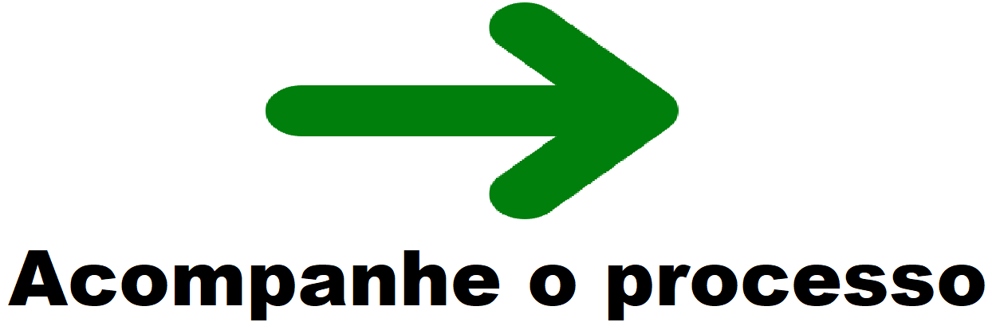

_Adotando a estratégia "dividir para conquistar", quebrei as fases em etapas e subetapas para que o procedimento de implementação aconteça sem grandes problemas e com todas as possibilidades cobertas e pensadas desde o inicio do projeto, antes de escrever qualquer linha de código_

---

### Fase 1: Configuração e Análise Inicial

O objetivo desta fase é preparar o ambiente e entender os dados que você irá trabalhar.

#### Etapa 1.1: Configuração do Ambiente
* **Subetapa 1.1.1:** Instalar o Python (se ainda não tiver).
* **Subetapa 1.1.2:** Instalar as bibliotecas necessárias: `pandas` e `Jupyter Notebook`.
    * Comando no terminal: `pip install pandas jupyter`
* **Subetapa 1.1.3:** Criar a estrutura de pastas do projeto (por exemplo, uma pasta principal `projeto_etl_notas` com subpastas `data`, `notebooks` e `database`).

#### Etapa 1.2: Aquisição e Exploração dos Dados
* **Subetapa 1.2.1:** Baixar o dataset do Kaggle e salvá-lo na pasta `data`.
* **Subetapa 1.2.2:** Abrir um novo **Jupyter Notebook** na pasta `notebooks`.
* **Subetapa 1.2.3:** Carregar o(s) arquivo(s) CSV para um `DataFrame` do `pandas`.
* **Subetapa 1.2.4:** Fazer uma análise exploratória inicial:
    * Verificar as primeiras linhas do DataFrame (`df.head()`).
    * Verificar o tipo de dados de cada coluna (`df.info()`).
    * Verificar se há valores nulos (`df.isnull().sum()`).
    * Analisar estatísticas básicas das colunas numéricas (`df.describe()`).

---

### Fase 2: Construção da Lógica de ETL (O Coração do Projeto)

Esta é a fase mais importante, onde você irá manipular os dados de acordo com os requisitos.

#### Etapa 2.1: Implementação da Transformação (T)
* **Subetapa 2.1.1:** Lidar com dados nulos. Por exemplo, preencher valores nulos de notas com `0` ou a média.
* **Subetapa 2.1.2:** Normalizar as colunas de texto (nomes de cursos, etc.) para evitar inconsistências (por exemplo, converter para letras maiúsculas ou minúsculas).
* **Subetapa 2.1.3:** Validar e corrigir os tipos de dados. Garantir que a coluna de notas seja do tipo numérico (float ou int).

#### Etapa 2.2: Implementação da Carga (L)
* **Subetapa 2.2.1:** Criar uma conexão com o banco de dados **SQLite** dentro do seu Notebook.
* **Subetapa 2.2.2:** Definir o nome da tabela que irá receber os dados, por exemplo, `tabela_notas`.
* **Subetapa 2.2.3:** Utilizar o `pandas` para carregar o DataFrame já tratado para a tabela SQLite.
    * `df_tratado.to_sql('tabela_notas', conn, if_exists='replace', index=False)`
* **Subetapa 2.2.4:** Verificar se a tabela foi criada e populada corretamente, executando uma simples consulta SQL (`SELECT * FROM tabela_notas LIMIT 5`).

---

### Fase 3: Análise com SQL e Documentação

Nesta fase, você irá demonstrar o valor do seu trabalho, respondendo a perguntas com as consultas SQL.

#### Etapa 3.1: Execução das Análises (SQL)
* **Subetapa 3.1.1:** Criar uma nova célula no Notebook para cada consulta SQL.
* **Subetapa 3.1.2:** Escrever e executar as consultas para responder às perguntas-chave do projeto.
    * Qual a média de notas por curso?
    * Quais alunos tiveram a maior média?
    * Qual a distribuição de notas em uma matéria específica?
* **Subetapa 3.1.3:** Anotar os resultados e as conclusões de cada consulta.

#### Etapa 3.2: Finalização e Documentação
* **Subetapa 3.2.1:** Adicionar comentários detalhados ao longo do Notebook explicando o que cada bloco de código faz.
* **Subetapa 3.2.2:** Escrever uma introdução e uma conclusão para o projeto, explicando o objetivo, a metodologia e os resultados obtidos.
* **Subetapa 3.2.3:** Salvar o Notebook final e o banco de dados SQLite para uso futuro.

## Processo de Desenvolvimento, passo a passo:

